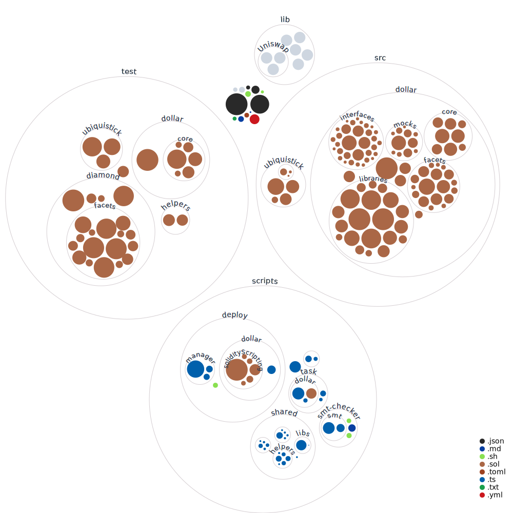
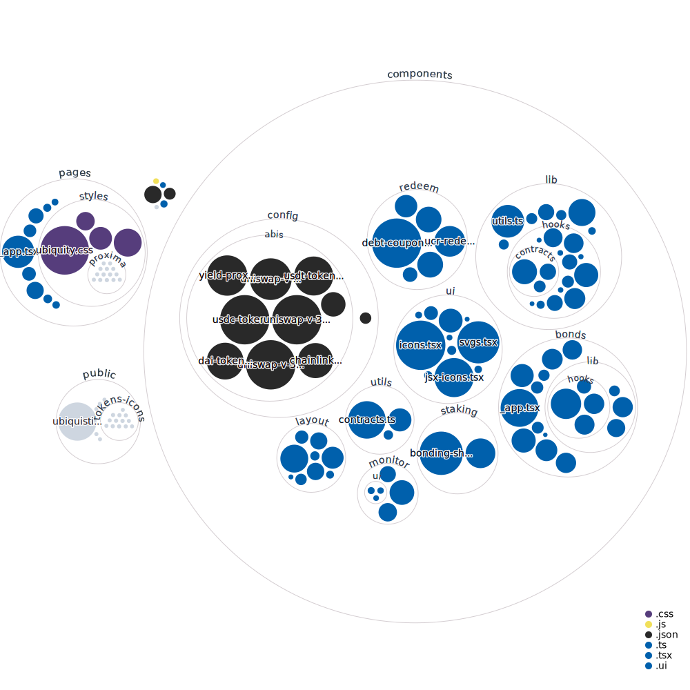

[](https://github.com/ubiquity/ubiquity-dollar/actions/workflows/build-and-test.yml)
[](https://coveralls.io/github/ubiquity/ubiquity-dollar?branch=development)
# Ubiquity Dollar
Introducing the flagship product of [Ubiquity DAO](https://ubq.fi/). The Ubiquity Dollar (uAD) is a collateralized stablecoin.
- The deployed smart contracts can be found in the [docs](https://dao.ubq.fi/smart-contracts).
- The source code for those are archived [here](https://github.com/ubiquity/uad-contracts).


## Contributing
- We welcome everybody to participate in improving the codebase.
- We offer financial incentives for solved issues.
- Please learn how to contribute via the DevPool [here](https://dao.ubq.fi/devpool).
## Installation
- We use [Foundry](https://github.com/foundry-rs/foundry).
- Here are their [docs](https://book.getfoundry.sh/).
- Please follow their installation guide for your OS before proceeding.

### Development Setup
```sh
#!/bin/bash

git clone https://github.com/ubiquity/ubiquity-dollar.git
cd ubiquity-dollar/
yarn # fetch dependencies
yarn build:all # builds the smart contracts and user interface
yarn start # starts the user interface and daemonize'd to continue to run tests in the background
yarn test:all
```

## Running workspace specific commands
Utilizing yarn workspaces, you can invoke scripts for each workspace individually.
```sh
# SCRIPT_NAME=XXX

yarn workspace @ubiquity/contracts $SCRIPT_NAME
yarn workspace @ubiquity/dapp $SCRIPT_NAME

# For example...

yarn workspace @ubiquity/contracts build # Build smart contracts
yarn workspace @ubiquity/contracts test # Run the smart contract unit tests

yarn workspace @ubiquity/dapp build # Build the user interface
yarn workspace @ubiquity/dapp start # Run the application at http://localhost:3000

```
## Committing Code

1. We [automatically enforce](https://github.com/conventional-changelog/commitlint) the [conventional commits](https://www.conventionalcommits.org/en/v1.0.0/) format for commit messages.

> The Conventional Commits specification is a lightweight convention on top of commit messages. It provides an easy set of rules for creating an explicit commit history; which makes it easier to write automated tools on top of.

2. We use [prettier](https://github.com/prettier/prettier), [eslint](https://github.com/eslint/eslint) and [cspell](https://github.com/streetsidesoftware/cspell) on [staged files](https://github.com/okonet/lint-staged) in order to enforce a uniform code style. Please do not circumvent these rules.


### Network Settings
| Network | Chain ID | RPC Endpoint                  | Comment |
|---------|----------|-------------------------------|---------|
| `mainnet` | `1`        | `https://eth.ubq.fi/v1/mainnet` | Our dedicated mainnet gateway     |
| `anvil`   | `31337`    | `http://127.0.0.1:8545`         | Used for local development     |

## Deploying Contracts (Ubiquity Dollar Core)

In two separate terminals run the following commands:

```sh
yarn workspace @ubiquity/contracts start:anvil # starts the anvil forked mainnet network
```

```sh
yarn workspace @ubiquity/contracts deploy:development # deploys the contracts to the anvil testnet
```

You need to create `.env` file inside the contracts folder with `PRIVATE_KEY`, `PUBLIC_KEY`, `MNEMONIC`, and `CURVE_WHALE` all filled. `PRIVATE_KEY` will be used to deploy locally and the matching `PUBLIC_KEY` will be the admin on all the smart contracts. `MNEMONIC` is used when launching Anvil and will ensure your `PUBLIC_KEY` account is funded.

The `.env.example` is pre-populated with the recommend test `MNEMONIC`, test `PRIVATE_KEY`, and test `PUBLIC_KEY`.

If successful it will show a readout of accounts generated from `MNEMONIC` and the port it's listening on.

This will first impersonate the `CURVE_WHALE` and transfer some tokens so we can create a UbiquityDollar/3CRV pool, and then it will deploy the Ubiquity Dollar core protocol via a series of Solidity scripts via Forge.

## Commiting, Sending PRs

- We require all PRs meet the issues expectation and/or to follow the discussions accordingly and implement all necessary changes and feedback by reviewers.
- We run CI jobs all CI jobs must pass before commiting/merging a PR with a few exceptions, this would likely happen when a PR it's getting reviewed 

## Yarn Workspaces

The repo has been built as a [yarn workspace](https://yarnpkg.com/features/workspaces) monorepo.

<pre>
&lt;root&gt;
├── <a href="https://github.com/ubiquity/ubiquity-dollar/tree/development/packages">packages</a>
│   ├── <a href="https://github.com/ubiquity/ubiquity-dollar/tree/development/packages/contracts">contracts</a>: Smart contracts for Ubiquity Dollar and UbiquiStick
│   ├── <a href="https://github.com/ubiquity/ubiquity-dollar/tree/development/packages/dapp">dapp</a>: User interface
</pre>

## Codebase Diagram

[Interactive Version](https://mango-dune-07a8b7110.1.azurestaticapps.net/?repo=ubiquity%2Fubiquity-dollar)

### Smart Contracts



### User Interface



---

Sine stabilitate nihil habemus.
